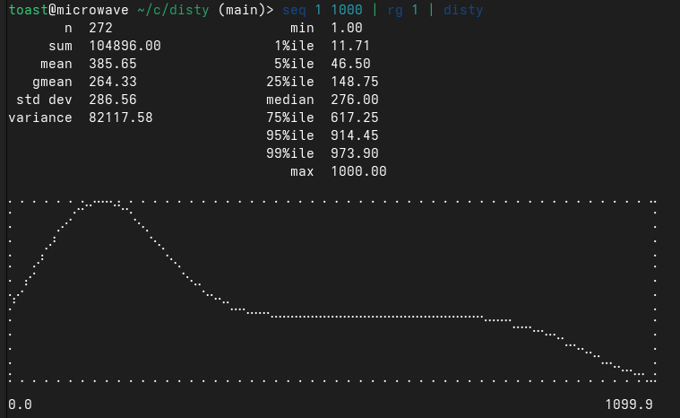

# disty

disty is a quick CLI for getting an idea of the distribution of a list of numbers.

disty is a rewrite of [Michael Knyszek's distx](https://github.com/mknyszek/toolbox/tree/main/cmd/distx), which is itself an extension of [Austin Clements' dist](https://github.com/aclements/go-moremath/tree/master/cmd/dist). I love using distx for all sorts of quick checks at work, from checking the distribution of database shards to analyzing network requests. I ran into performance issues for processing large lists (>10m records).

Compared to distx, this version:

- Is very fast: ~45x faster in local testing. This boils down to parallelizing the KDE plotting and using `mmap` to parallelize parsing the number list.
    ```bash
    $ seq 1 10000000 | rg 1 > /tmp/large_seq
    $ wc -l /tmp/large_seq
    5217032 /tmp/large_seq
    $ hyperfine --warmup 3 'distx /tmp/large_seq' 'disty /tmp/large_seq'
    Benchmark 1: distx /tmp/large_seq
    Time (mean ± σ):     10.057 s ±  0.493 s    [User: 10.054 s, System: 0.257 s]
    Range (min … max):    9.111 s … 10.772 s    10 runs
    
    Benchmark 2: disty /tmp/large_seq
    Time (mean ± σ):     225.2 ms ±  11.6 ms    [User: 1760.0 ms, System: 38.6 ms]
    Range (min … max):   209.9 ms … 246.7 ms    13 runs
    
    Summary
    disty /tmp/large_seq ran
    44.65 ± 3.18 times faster than distx /tmp/large_seq
    ```

- Has marginally better plotting, which mostly comes down to setting a higher resolution than distx uses by default. 

- Has less features. I haven't ported the output options or alternative plotting (CDFs), because I don't really use them. 

## Installing

Clone and install through Cargo.

```sh
$ cargo install --path .
```

## Usage

```bash
$ disty --help
Summarizes numerical distributions

Usage: disty [OPTIONS] [INPUT] [OUTPUT]

Arguments:
  [INPUT]   Input file (stdin if not specified)
  [OUTPUT]  Output file (stdout if not specified)

Options:
  -u, --unit <UNIT>  Input unit [possible values: ns, us, ms, s, B, KB, MB, GB, TB, PB, KiB, MiB, GiB, TiB, PiB]
  -f, --fmt <FMT>    Output format [possible values: float, hex, time, bytes]
      --no-plot      Skip KDE plotting
  -h, --help         Print help
  -V, --version      Print version
```
